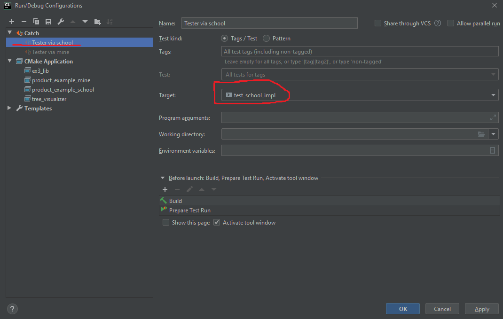
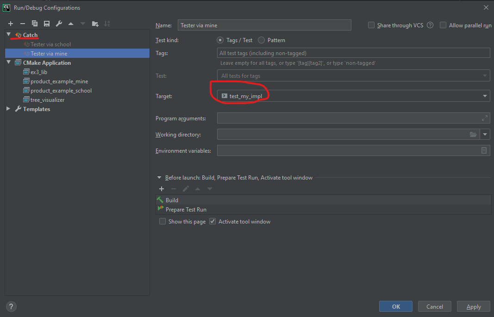
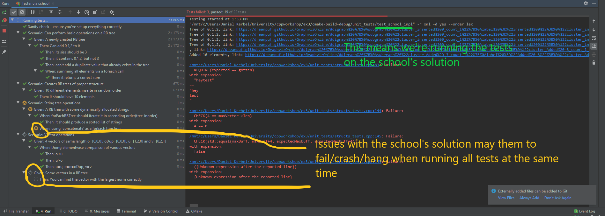
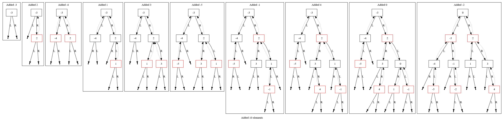
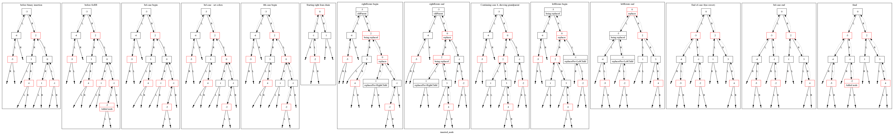

# Introduction
This repository contains two key components

- A test suite based on C++ ([Catch2]() library)
- A tree visualization library that uses Graphviz(the `dot` program) to
  compile
  
The build process(compilation, linkage, etc..) is managed entirely by CMake - this is different
from 'Make' which was taught at the course - it is a higher level tool, that can potentially support many different environments,
it integrates well with CLion & other IDEs, and is the most popular C/C++ build tool.


## Requirements

These tests were designed to be run purely via CLion, on a HUJI Linux system.
Advanced users may run this in Windows by using WSL or a Linux VM - this requires the `graphviz`, `cmake` software along
with a C/C++ development toolchain. I won't explain how to do that here - feel free to google for more information.

## Installation & Running

1. Clone this repository (via `git clone https://github.cs.huji.ac.il/danielkerbel/tests_c_ex3.git EX3_FOLDER`) where `EX3_FOLDER`
is a *new* directory. 

2. Move your previous `Structs.c` and `RBTree.c` files to this folder. (Or create them if you're just starting out)

   In order to run the tests for RBTree, you must **define all functions** that were declared at `RBTree.h` in `Structs.c` - you can provide
   empty implementations(e.g return 0/NULL), but they must still be defined.
   
   In order the tests for Structs, you must **define all functions** that were declared at `Structs.h` in `Structs.c`, and
   the same for `RBTree.h` and `RBtree.c` - **some of theses tests depend on the correct functionality of RBTree!**
   
3. Open `EX3_FOLDER` via CLion, it might take a couple of minutes for indexing to finish

4. Do `File | Reload CMake Project` followed by `Build | Build 'All' in 'Debug'` - assuming you've setup

5. Add the following run configurations via `Run | Edit Configurations | + Catch`:
    
    
    
    Note that the rest of the configurations should've been automatically created by CMake (namely `product_example_school` and
    `product_example_mine` which let you run `ProductExample` on the school solution or on yours.)
    
5. You can now run a configuration via `Run | Run ... | NAME_OF_CONFIGURATION`, optionally running with `Valgrind` which is highly
   recommended.
   
   - `Tester via school`: Runs all tests on the school's implementation
   - `Tester via mine`: Runs all tests n your implementation
   
   You can run a specific test file(`unit_tests/structs_tests.cpp` or `tree_tests.cpp`) by right clicking on the file and
   doing `Run 'all in ....'`
   
   You can also run a specific test scenario by going to a test file and clicking the green arrow next to it.
   
   **NOTE** Whether this will run the test on your own implementation, or on the school's implementation, may
   differ - when starting a test this way, it creates a new `Run Configuration` - you can edit it and switch the target
   between `test_school_impl` or `test_my_impl`
   
   **ANOTHER IMPORTANT NOTE** The school's implementation seems to contain some memory issues and bugs that will cause issues when running
   all tests, namely, `Scenario: String tree operations` and `Scenario: Vector operations - Given some vectors in a RB tree`
   
   
   * TODO: check in forum regarding newlines in concatenation, and crashes with finding max vector norm
     
# Tree visualization

Tree visualization is built in the testers (via the `DotTracer` class, a C++ class), but is also exposed to C via functions
defined at `tree_visualizer/graph_drawer.h`

When running tests that create a tree, the tester prints to STDOUT links to a website that displays a visual representaiton of that tree.
(You can click on them in CLion and it'll open them in your web browser)
Also, the same picture is created via the `dot` program to the `cmake-build-debug/unit_tests` folder

**NOTE** Due to limitation of web browsers, some trees generate very large links that don't work - in those cases, use the
automatically generated pictures in the folder specified above.

Here's an example of a tree built via the school's solution:


## Using the tree visualization as a C library

While the images generated by the above tests are useful, you can create much more detailed and useful visualizations by
using the library in your own code, in a procedural style.
This is extremely useful for debugging complex operations, for example:



### Usage

In your RBTree.c, add the following line at the beginning
```c
#include "tree_visualizer/graph_drawer.h"
```


You can then use the functions declared at `tree_visualizer/graph_drawer.h` for visualizing graphs. 
I highly recommend you to go over that file(NOTE: it will likely undergo some changes), but here's an example taken from
`ProductExample.c` main, modified to trace the tree:

```c
RBTree *tree = newRBTree(productComparatorByName, productFree);
setFormatter(productFormattter);
addToRBTree(tree, products[2]);
addStep(tree->root, "added 1 product");
addToRBTree(tree, products[3]);
addStep(tree->root, "added 2 products");
addToRBTree(tree, products[4]);
addStep(tree->root, "added 3 products");
addToRBTree(tree, products[0]);
addStep(tree->root, "added 4 products");
finish("ProductExample-added 4 products");
```

The file/link is only emitted upon the finish call, and it will create the image `cmake-build-debug/ProducExample-added 4 products_0.png`
as well as a link in STDOUT. As explained before, for larger trees, you won't be able to use the link and must use the generated image.

* You can of course use recursion and use many `addStep` calls within them, terminating with a `finish` call (e.g, after fixing
the RB tree)

* You can have multiple addStep...finish sequences, note that `finish` will overwrite any previous image with the same filename,
this is noticeable especially when running tests - but if you use a debugger, you can pause the program at an interesting
test case and then inspect the image that was generated for it.

* You can disable visualizations by commenting the add_definitions line at `tree_visualizer/CMakeLists.txt`

   
# Common errors and isuses
- While compiling or running, you may get input similar to the following:

    ```
    [100%] Linking CXX executable test_my_impl
    CMakeFiles/test_my_impl.dir/tree_tests.cpp.o: In function `____C_A_T_C_H____T_E_S_T____2()':
    /mnt/c/Users/Daniel Kerbel/University/cppworkshop/ex3/unit_tests/tree_tests.cpp:37: undefined reference to `newRBTree'
    /mnt/c/Users/Daniel Kerbel/University/cppworkshop/ex3/unit_tests/tree_tests.cpp:43: undefined reference to `addToRBTree'
    /mnt/c/Users/Daniel Kerbel/University/cppworkshop/ex3/unit_tests/tree_tests.cpp:45: undefined reference to `addToRBTree'
    /mnt/c/Users/Daniel Kerbel/University/cppworkshop/ex3/unit_tests/tree_tests.cpp:47: undefined reference to `addToRBTree'
    /mnt/c/Users/Daniel Kerbel/University/cppworkshop/ex3/unit_tests/tree_tests.cpp:57: undefined reference to `containsRBTree'
    /mnt/c/Users/Daniel Kerbel/University/cppworkshop/ex3/unit_tests/tree_tests.cpp:58: undefined reference to `containsRBTree'
    /mnt/c/Users/Daniel Kerbel/University/cppworkshop/ex3/unit_tests/tree_tests.cpp:59: undefined reference to `containsRBTree'
    /mnt/c/Users/Daniel Kerbel/University/cppworkshop/ex3/unit_tests/tree_tests.cpp:60: undefined reference to `containsRBTree'
    /mnt/c/Users/Daniel Kerbel/University/cppworkshop/ex3/unit_tests/tree_tests.cpp:64: undefined reference to `addToRBTree'
    /mnt/c/Users/Daniel Kerbel/University/cppworkshop/ex3/unit_tests/tree_tests.cpp:70: undefined reference to `forEachRBTree'
    /mnt/c/Users/Daniel Kerbel/University/cppworkshop/ex3/unit_tests/tree_tests.cpp:80: undefined reference to `freeRBTree'
    CMakeFiles/test_my_impl.dir/tree_tests.cpp.o: In function `createTestFile(std::vector<int, std::allocator<int> >, std::__cxx11::basic_string<char, std::char_traits<char>, std::allocator<char> >)':
    /mnt/c/Users/Daniel Kerbel/University/cppworkshop/ex3/unit_tests/tree_tests.cpp:92: undefined reference to `newRBTree'
    /mnt/c/Users/Daniel Kerbel/University/cppworkshop/ex3/unit_tests/tree_tests.cpp:97: undefined reference to `addToRBTree'
    /mnt/c/Users/Daniel Kerbel/University/cppworkshop/ex3/unit_tests/tree_tests.cpp:105: undefined reference to `freeRBTree'
    CMakeFiles/test_my_impl.dir/tree_tests.cpp.o: In function `____C_A_T_C_H____T_E_S_T____11()':
    /mnt/c/Users/Daniel Kerbel/University/cppworkshop/ex3/unit_tests/tree_tests.cpp:120: undefined reference to `newRBTree'
    /mnt/c/Users/Daniel Kerbel/University/cppworkshop/ex3/unit_tests/tree_tests.cpp:128: undefined reference to `addToRBTree'
    /mnt/c/Users/Daniel Kerbel/University/cppworkshop/ex3/unit_tests/tree_tests.cpp:136: undefined reference to `forEachRBTree'
    /mnt/c/Users/Daniel Kerbel/University/cppworkshop/ex3/unit_tests/tree_tests.cpp:144: undefined reference to `freeRBTree'
    CMakeFiles/test_my_impl.dir/structs_tests.cpp.o: In function `vectors_to_tree(std::initializer_list<Vector*>)':
    /mnt/c/Users/Daniel Kerbel/University/cppworkshop/ex3/unit_tests/structs_tests.cpp:25: undefined reference to `freeVector'
    /mnt/c/Users/Daniel Kerbel/University/cppworkshop/ex3/unit_tests/structs_tests.cpp:25: undefined reference to `vectorCompare1By1'
    /mnt/c/Users/Daniel Kerbel/University/cppworkshop/ex3/unit_tests/structs_tests.cpp:25: undefined reference to `newRBTree'
    /mnt/c/Users/Daniel Kerbel/University/cppworkshop/ex3/unit_tests/structs_tests.cpp:28: undefined reference to `addToRBTree'
    CMakeFiles/test_my_impl.dir/structs_tests.cpp.o: In function `strings_to_tree(std::initializer_list<std::__cxx11::basic_string<char, std::char_traits<char>, std::allocator<char> > > const&)':
    /mnt/c/Users/Daniel Kerbel/University/cppworkshop/ex3/unit_tests/structs_tests.cpp:35: undefined reference to `freeString'
    /mnt/c/Users/Daniel Kerbel/University/cppworkshop/ex3/unit_tests/structs_tests.cpp:35: undefined reference to `stringCompare'
    /mnt/c/Users/Daniel Kerbel/University/cppworkshop/ex3/unit_tests/structs_tests.cpp:35: undefined reference to `newRBTree'
    /mnt/c/Users/Daniel Kerbel/University/cppworkshop/ex3/unit_tests/structs_tests.cpp:41: undefined reference to `addToRBTree'
    CMakeFiles/test_my_impl.dir/structs_tests.cpp.o: In function `____C_A_T_C_H____T_E_S_T____0()':
    /mnt/c/Users/Daniel Kerbel/University/cppworkshop/ex3/unit_tests/structs_tests.cpp:65: undefined reference to `forEachRBTree'
    /mnt/c/Users/Daniel Kerbel/University/cppworkshop/ex3/unit_tests/structs_tests.cpp:81: undefined reference to `concatenate'
    /mnt/c/Users/Daniel Kerbel/University/cppworkshop/ex3/unit_tests/structs_tests.cpp:81: undefined reference to `forEachRBTree'
    /mnt/c/Users/Daniel Kerbel/University/cppworkshop/ex3/unit_tests/structs_tests.cpp:86: undefined reference to `freeRBTree'
    CMakeFiles/test_my_impl.dir/structs_tests.cpp.o: In function `____C_A_T_C_H____T_E_S_T____6()':
    /mnt/c/Users/Daniel Kerbel/University/cppworkshop/ex3/unit_tests/structs_tests.cpp:105: undefined reference to `vectorCompare1By1'
    /mnt/c/Users/Daniel Kerbel/University/cppworkshop/ex3/unit_tests/structs_tests.cpp:109: undefined reference to `vectorCompare1By1'
    /mnt/c/Users/Daniel Kerbel/University/cppworkshop/ex3/unit_tests/structs_tests.cpp:113: undefined reference to `vectorCompare1By1'
    /mnt/c/Users/Daniel Kerbel/University/cppworkshop/ex3/unit_tests/structs_tests.cpp:114: undefined reference to `vectorCompare1By1'
    /mnt/c/Users/Daniel Kerbel/University/cppworkshop/ex3/unit_tests/structs_tests.cpp:115: undefined reference to `vectorCompare1By1'
    CMakeFiles/test_my_impl.dir/structs_tests.cpp.o:/mnt/c/Users/Daniel Kerbel/University/cppworkshop/ex3/unit_tests/structs_tests.cpp:116: more undefined references to `vectorCompare1By1' follow
    CMakeFiles/test_my_impl.dir/structs_tests.cpp.o: In function `____C_A_T_C_H____T_E_S_T____6()':
    /mnt/c/Users/Daniel Kerbel/University/cppworkshop/ex3/unit_tests/structs_tests.cpp:121: undefined reference to `freeVector'
    /mnt/c/Users/Daniel Kerbel/University/cppworkshop/ex3/unit_tests/structs_tests.cpp:122: undefined reference to `freeVector'
    /mnt/c/Users/Daniel Kerbel/University/cppworkshop/ex3/unit_tests/structs_tests.cpp:123: undefined reference to `freeVector'
    /mnt/c/Users/Daniel Kerbel/University/cppworkshop/ex3/unit_tests/structs_tests.cpp:124: undefined reference to `freeVector'
    /mnt/c/Users/Daniel Kerbel/University/cppworkshop/ex3/unit_tests/structs_tests.cpp:140: undefined reference to `findMaxNormVectorInTree'
    /mnt/c/Users/Daniel Kerbel/University/cppworkshop/ex3/unit_tests/structs_tests.cpp:146: undefined reference to `freeVector'
    /mnt/c/Users/Daniel Kerbel/University/cppworkshop/ex3/unit_tests/structs_tests.cpp:149: undefined reference to `freeRBTree'
    collect2: error: ld returned 1 exit status
    unit_tests/CMakeFiles/test_my_impl.dir/build.make:124: recipe for target 'unit_tests/test_my_impl' failed
    make[3]: *** [unit_tests/test_my_impl] Error 1
    CMakeFiles/Makefile2:253: recipe for target 'unit_tests/CMakeFiles/test_my_impl.dir/all' failed
    make[2]: *** [unit_tests/CMakeFiles/test_my_impl.dir/all] Error 2
    CMakeFiles/Makefile2:265: recipe for target 'unit_tests/CMakeFiles/test_my_impl.dir/rule' failed
    make[1]: *** [unit_tests/CMakeFiles/test_my_impl.dir/rule] Error 2
    Makefile:170: recipe for target 'test_my_impl' failed
    make: *** [test_my_impl] Error 2
    ```
   this means you didn't put the `Structs.c` or `RBTree.c` file in the folder, or haven't defined the necessary functions
   noted in the text.
   
   
- While running, a test may fail with an error similar to this one:

    ```
    /mnt/c/Users/Daniel Kerbel/University/cppworkshop/ex3/unit_tests/structs_tests.cpp:145: Failure:
      ({Unknown expression after the reported line})
    with expansion:
      {Unknown expression after the reported line}
    ```
  
  This usually means that your program has crashed while running the test. Running the test with the CLion's debugger
  will usually provide you with information about the crash.